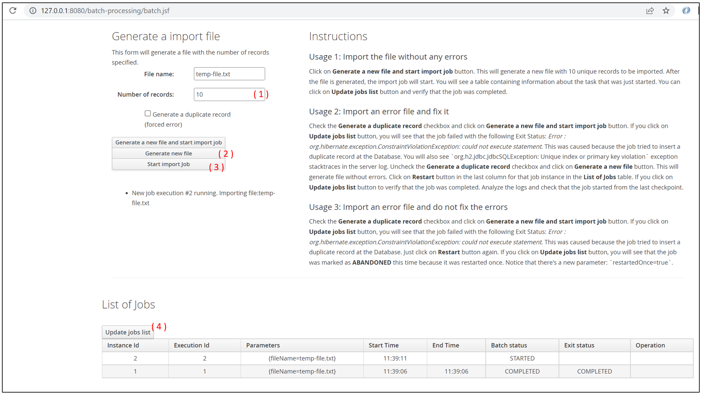

## 公式サイト

無料版のwildflyの実装は結論的に使えない。mavenパスが通らない等。[パス](https://repository.jboss.org/nexus/content/groups/public/org/wildfly/quickstarts/wildfly-quickstart-parent/2/wildfly-quickstart-parent-2.pom)

[wildfly公式](https://www.wildfly.org/downloads/)
[wildfly公式-github-26.1.1.Final](https://github.com/wildfly/quickstart/tree/26.1.1.Final)


jboss eap 公式サイトよりQuick Startsサンプルソース、Jboss eap, Maven Repositoryをダウンロードし、下記作業フォルダを作成する。バージョンは7.4.0。[JBoss EAP All Downloads](https://developers.redhat.com/products/eap/download?extIdCarryOver=true&sc_cid=701f2000001OH7JAAW)


## 作業フォルダ構成

```sh
test
│  01_jboss-start.bat				// jboss起動
│  02_deploy-war.bat				// ローカル開発環境デプロイする。※jboss起動状態の前提で実行する
│  127.0.0.1-8080.bat				// ローカル開発環境のapp画面起動
│  127.0.0.1-9990.bat				// ローカル開発環境の管理画面起動
│  README.md
├─docker-image
│  └─target
│      ├─jboss-eap-7.4				// ローカル開発環境で動かすJboss,jboss-eap-7.4.0.zipを解凍して取得
│      ├─batch-processing.war		// docker image作成用、sourceのtargetから取得
│      └─jboss-eap-7.4.0.zip		// docker image作成用、公式サイトから取得
│  └─Dockerfile						// docker image作成用
└─source							// 公式サイトから取得したキックスターターサンプルコード（JBatchのみ）
    ├─pom.xml						
    └─batch-processing
        └─pom.xml					// ここでデプロイmaven実行
```


## 開発環境の操作手順 

- 「test > 01_jboss-start.bat」を実行し、jbossを起動して置く。

- 「test > source > batch-processing」eclipse等でコードを書く。

-  コーディングを完了し、「source > 02_deploy-war.bat」実行。 ※jbossは常に起動状態を維持。

- 「test > 127.0.0.1-8080.bat」実行し、アプリの画面を起動。

  

## サンプルAPP 

- (1) 　テスト用INPUT用ファイルのレコード数を入力する
- (2)　入力したレコード数分のファイルを生成して置く
- (3) 　バッチを起動させる
- (4)　クリックし、常にバッチの状態を確認する




## リモートサーバdocker image作成手順

- 「test > docker-image」フォルダをリモートサーバの「/root」直下へFTPで転送　※「jboss-eap-7.4」フォルダは除外
- 以下コマンドを実施

```sh
# Dockerfileファイルの位置に移動
cd /root/docker-image

# ビルドを実行し、docker imageを作成
docker build -t my-jboss:v1.0 .

# 作成されたimageを確認
docker images

# 作成されたimageを実行し、コンテナーを起動させる
docker run -it -d --name demo-app -p 8080:8080 -p 9990:9990 my-jboss:v1.0 

# 作成されたコンテナーを確認し
docker ps

# 外部マシンでグロバルIP叩をいてアプリにアクセス
start chrome.exe http://x.x.x.x:8080/batch-processing/batch.jsf
```


## Dockerfileファイル

```sh
# centos7.9.2009をベースとしてカスタマイズする
FROM centos:centos7.9.2009

# 作成者、メンテナ
LABEL maintainer=dodoroyb

# デプロイするwarファイルをコンテナーをの「/root」直下にコピーする
COPY ./target/*.war /root/

# jboss eapをコンテナーをの「/root」直下にコピーする
COPY ./target/*.zip /root/

# コンテナーの中でjava-1.8をインストールする
RUN yum install -y java-1.8.0-openjdk

# コンテナーの中で回答ソフトをインストールする
RUN yum install -y unzip

# 作業ディレクトリを指定する、cdコマンドに該当するイメージ
WORKDIR /root

# jboss eap解凍する　※RUNはビルド時のみ実行される
RUN unzip jboss-eap-7.4.0.zip

# jboss eapの環境変数を設定
ENV JBOSS_HOME=/root/jboss-eap-7.4

# warをデプロイ先フォルダへコピーする　※RUNはビルド時のみ実行される
RUN cp /root/batch-processing.war ${JBOSS_HOME}/standalone/deployments/

# コンテナーの中のjboss-eapを起動　※ENTRYPOINTはコンテナー起動時のみ実行される
ENTRYPOINT ["/root/jboss-eap-7.4/bin/standalone.sh"]
```

